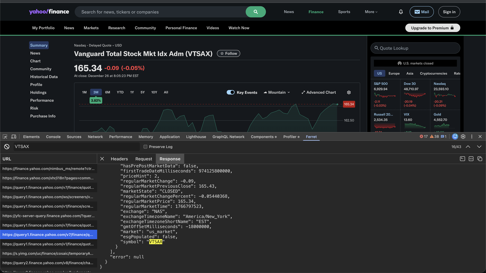

# Ferret

**A network inspector with ability to search through headers, request and response bodies of Fetch/XHR requests.**

The network tab in the Chrome devtools has a filter, but it only filters requests based on the request url. I wanted to
be able to filter through tens or hundreds (some sites are ridiculous) of requests to find one based on a specific
header, or something in the request body, or something in the response. An existing workaround is to record the network
activity, download the .har file from the devtools and search through it with the text editor of your choice. That is
fine occasionally, but is really annoying when you have to do that repeatedly. Now, Ferret can do that for you in your
devtools.

Key features include:

- Search through headers, request and response bodies of Fetch/XHR requests
- View request methods, status, sizes, and timings
- Preserve logs through page reloads just like Chrome devtools
- Copy a request to clipboard as CURL
- Copy a request to clipboard as Javascript Fetch
- Copy headers, request body or response body to clipboard

## Installation

Ferret hasn't been added to the Chrome store yet, in the meantime, it can be installed for now by downloading the latest
release from Github and then manually installing in Chrome.

1. Download the latest release [here](https://github.com/kadenbarlow/ferret/releases) and unzip
1. Open chrome://extensions/
1. Enable developer mode in the top right corner
1. Click "Load unpacked" in the top left corner and navigate to the directory you unzipped in step 1
1. Happy ferreting!

